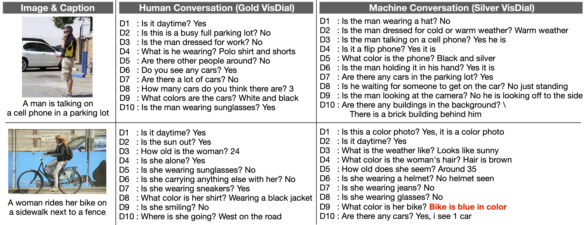

Generative Self-Training for Visual Dialog
===========================================

Pytorch Implementation for the paper:

**[The Dialog Must Go On: Improving Visual Dialog via Generative Self-Training][1]** <br>
[Gi-Cheon Kang][2], [Sungdong Kim][3]<sup>\*</sup>, [Jin-Hwa Kim][4]<sup>\*</sup>, [Donghyun Kwak][5]<sup>\*</sup>, and [Byoung-Tak Zhang][6]  (\* equal contribution) <br>
**In CVPR 2023**

## Overview
<br><br>

Citation
-----------------------------
If you use this code or preprocessed data in your research, please consider citing:
```bibtex
@inproceedings{kang2023dialog,
  title={The Dialog Must Go On: Improving Visual Dialog via Generative Self-Training},
  author={Kang, Gi-Cheon and Kim, Sungdong and Kim, Jin-Hwa and Kwak, Donghyun and Zhang, Byoung-Tak},
  booktitle={CVPR},
  year={2023}
}
```

## Table of Contents
* [Setup and Dependencies](#Setup-and-Dependencies)
* [Download Data](#Download-Data)
* [Pre-trained Checkpoints](#Pre-trained-Checkpoints)
* [Training](#Training)
* [Adaptation to Discriminative Visual Dialog](#Adaptation-to-Discriminative-Visual-Dialog)
* [Visual Dialog Generation](#Visual-Dialog-Generation)
* [Evaluation](#Evaluation)
* [Adversarial Robustness Study](#Adversarial-Robustness-Study)
* [Demo](#Demo)
* [Acknowledgements](#Acknowledgements)
* [License](#License)<br><br>


Setup and Dependencies
----------------------
This code is implemented using PyTorch v1.7+, and provides out of the box support with CUDA 11+ and CuDNN 7+. Anaconda/Miniconda is the recommended to set up this codebase: <br>

1. Install Anaconda or Miniconda distribution based on Python3.8+ from their [downloads' site][7].
2. Clone this repository and create an environment:

```shell
git clone https://www.github.com/gicheonkang/gst-visdial
conda env create -f env.yml

# activate the environment and install all dependencies
conda activate gst
cd gst-visdial/
```

Download Data
----------------------
1. Download the preprocessed original VisDial data, collected by [Das et al][8]. It includes Faster R-CNN bounding box image features of the MSCOCO dataset (80G) and preprocessed json files for dialog (2G). 
```shell
chmod +x scripts/download_preprocessed_human_visdial.sh
```

2. We also release the machine-generated VisDial data which consists of Faster R-CNN bounding box image features of the subset of the [Conceptual Captions 12M dataset][9] (nearly 2.4T with 3.6M images) and the corresponding machine-generated dialog data.

3. If you just want to use the machine-generated dialog data along with images, download the json files for the dialog data. The json file contains urls for image data. 
```shell
chmod +x scripts/download_preprocessed_machine_visdial.sh
```


Pre-trained Checkpoints
--------------------------------------
Please download the checkpoints to `checkpoints/` directory.

| Model | Trained Data | Link |
|:-------:|:---------:|:------:|
|Questioner | VisDial v1.0 |[Download](https://www.dropbox.com/s/y3jdbfdaccholu3/questioner_v1.0.ckpt)|
|Teacher | VisDial v1.0 | [Download](https://www.dropbox.com/s/5p4wyjb0hny691m/teacher_v1.0.ckpt)|
|Student | VisDial v1.0 + CC12M with Synthetic Dialogs (iter3)| [Download](https://www.dropbox.com/s/ycgbn2mh0mtoktv/student_v1.0_iter3.ckpt)|
|Student (Discriminative)| VisDial v1.0 + CC12M with Synthetic Dialogs (iter3)| [Download](https://www.dropbox.com/s/uxnlknhgzr8f8tq/student_v1.0_iter3_disc_dense.ckpt)
|Base Model from [VisDial-BERT][10]| CC3M + VQA | [Download](https://www.dropbox.com/s/g38qemmqep1tt1a/basemodel)|


Training
--------
Teacher model and questioner model training. Nearly 54G gpu memory is required to train the model. The argument `-enc_dec_a` denotes an encoder-decoder model for answerer model, and `-enc_dec_q` is the encoder-decoder model for questioner model.  
```shell
# Teacher model training
python train_gen.py \
  -mode vd_train \
  -start_path checkpoints/basemodel \
  -model enc_dec_a \
  -gpu_ids 0 1 2 3
```
```shell
# Questioner model training
python train_gen.py \
  -mode vd_train \
  -start_path checkpoints/basemodel \
  -model enc_dec_q \
  -gpu_ids 0 1 2 3
```

Student model training consists of two steps: (1) training on synthetically generated visual dialog dataset and (2) finetuning on original visual dialog dataset. The argument `-chunk` denotes the number of data chunk to use (default 30). `-select_data` is to use perplexity-based data selection method. After training on the synthetic dialog data, the student model is trained on the original visual dialog data. 
```shell
# training a synthetic visual dialog dataset
python train_gen.py \
  -mode cc12m_train \
  -select_data \
  -start_path checkpoints/basemodel \
  -save_path checkpoints/iter1/ \
  -chunk 30 \
  -gpu_ids 0 1 2 3 \
  -iter 1
```
```shell
# finetuning on a original visual dialog dataset 
python train_gen.py \
  -mode vd_train \
  -continue \
  -start_path checkpoints/iter1/cc12m_train_30_3.ckpt \
  -save_path checkpoints/iter1/ \
  -chunk 30 \
  -gpu_ids 0 1 2 3
```

Adaptation to Discriminative Visual Dialog
-------------------------------------------
A ["discriminative" visual dialog model][8] requires answer candidates for each question, but our proposed approach only generates the ground-truth answer. Hence, we propose tricks to train the discriminative model. Based on the encoder-decoder model pre-trained on the synthetic dataset, we finetune the encoder model on the original visdial dataset. Please see our paper (Appendix B) for more details. 
```shell
python train_disc.py \
  -mode vd_train \
  -continue \
  -model enc_only_a \
  -batch_size 40 \
  -train_dense \
  -num_negative_samples 5 \
  -start_path checkpoints/x30_start_iter3.ckpt \
  -save_path checkpoints/disc \
  -chunk 30 \
  -gpu_ids 0 1 2 3
```


Visual Dialog Generation
------------------------
<br><br>
Visual dialog generation given image features and captions. The questioner and the teacher alternately generates the visual question and corresponding answer, respectively. 

You can generate **your own visual dialog dataset** just feeding [Bottom-up Attention Features][12] and the caption data. We extracted the image features using the [docker container][13].  
```shell
python generate.py \
  -mode cc12m_gen \
  -cc12m_image_feats data/cc12m/features/cc12m_img_feat_0.lmdb/ \
  -cc12m_caption data/cc12m/captions/cc12m_filtered_0.json \
  -start_path_q checkpoints/questioner_v1.0.ckpt \
  -start_path_a checkpoints/teacher_v1.0.ckpt \
  -save_name cc12m_dialogs_0.txt \
  -save_path data/gen_dialog \
  -gpu_ids 0 1
```


Evaluation
----------
Evaluation of the student model on VisDial v1.0 validation split. Validation scores can be checked in offline setting. But if you want to evaluate the model on the test dataset, you should change the mode to `vd_eval_test` and submit the text file to [EvalAI online evaluation server][11]. Also, evaluation for the VisDial v0.9 validation dataset is available. Please add `-vd_version 0.9`.
```shell
python evaluate_gen.py \
  -mode vd_eval_val \
  -start_path checkpoints/student_v1.0_iter3.ckpt \
  -save_path results \
  -save_name gen.txt \
  -gpu_ids 0 1 2 3
```
Evaluation for the discriminative model is as follows.
```shell
python evaluate_disc.py \
  -mode vd_eval_val \
  -start_path checkpoints/student_v1.0_iter3_disc_dense.ckpt \
  -save_path results \
  -save_name disc.txt \
  -gpu_ids 0 1 2 3
```


Adversarial Robustness Study
----------------------------
We propose three different adversarial attacks for VisDial: (1) the FGSM attack, (2) a coreference attack, and (3) a random token attack. The FGSM attack perturbs input visual features, and the others attack the dialog history (textual inputs).

Simply run below for the FGSM attack
```shell
python evaluate_gen_attack.py \
  -mode vd_eval_val \
  -attack fgsm \
  -start_path checkpoints/student_v1.0_iter3.ckpt \
  -save_path results \
  -save_name fgsm.txt \
  -gpu_ids 0 1 2 3
```

For the textual attacks, preprocessing is required.
Download the [counter-fitted word embeddings][14] and run the preprocessing code below.
```shell
python comp_cos_sim_mat.py counter-fitted-vectors.txt
```
Then, run the script
```shell
python evaluate_gen_attack.py \
  -mode vd_eval_val \
  -attack coreference \
  -visdial_processed_val data/visdial/visdial_1.0_val_crowdsourced.json \
  -visdial_processed_val_dense_annotations data/visdial/visdial_1.0_val_dense_annotations_processed_crowdsourced.json
  -start_path checkpoints/student_v1.0_iter3.ckpt \
  -save_path results \
  -save_name coreference.txt \
  -gpu_ids 0 1 2 3
```

Demo
----
We prepare interactive demo to show our model's generated answer easily. Simply run and enter the image id in [VisDial v1.0 validation images][15]. 
```shell
python inference.py
```


Acknowledgements
-----------------
We use [VisDial-BERT][10] as reference code. Thanks!

License
-------
MIT License


[1]: https://arxiv.org/abs/2205.12502
[2]: https://gicheonkang.com
[3]: https://scholar.google.com/citations?user=xKrSnDoAAAAJ&hl=en
[4]: http://wityworks.com
[5]: https://scholar.google.com/citations?hl=en&user=MROzd8gAAAAJ
[6]: https://bi.snu.ac.kr/~btzhang/
[7]: https://conda.io/docs/user-guide/install/download.html
[8]: https://arxiv.org/pdf/1611.08669.pdf
[9]: https://arxiv.org/abs/2102.08981
[10]: https://github.com/vmurahari3/visdial-bert
[11]: https://eval.ai/web/challenges/challenge-page/518/overview
[12]: https://openaccess.thecvf.com/content_cvpr_2018/CameraReady/1163.pdf
[13]: https://hub.docker.com/r/airsplay/bottom-up-attention
[14]: https://drive.google.com/file/d/1bayGomljWb6HeYDMTDKXrh0HackKtSlx/view
[15]: https://visualdialog.org/data

